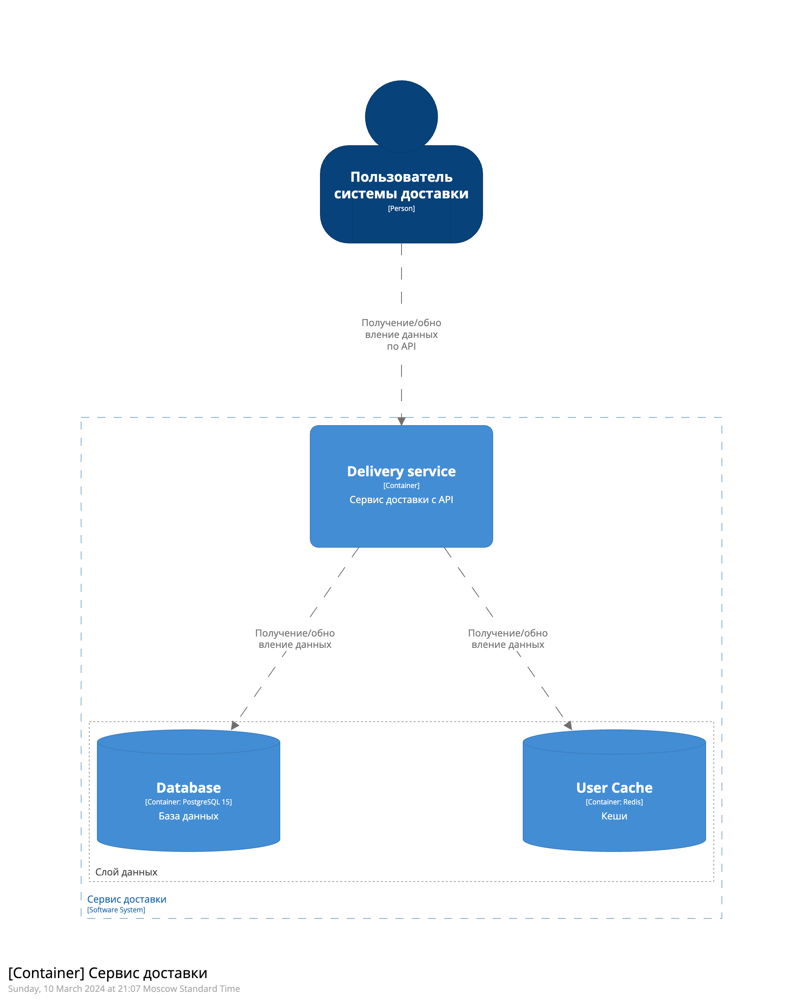
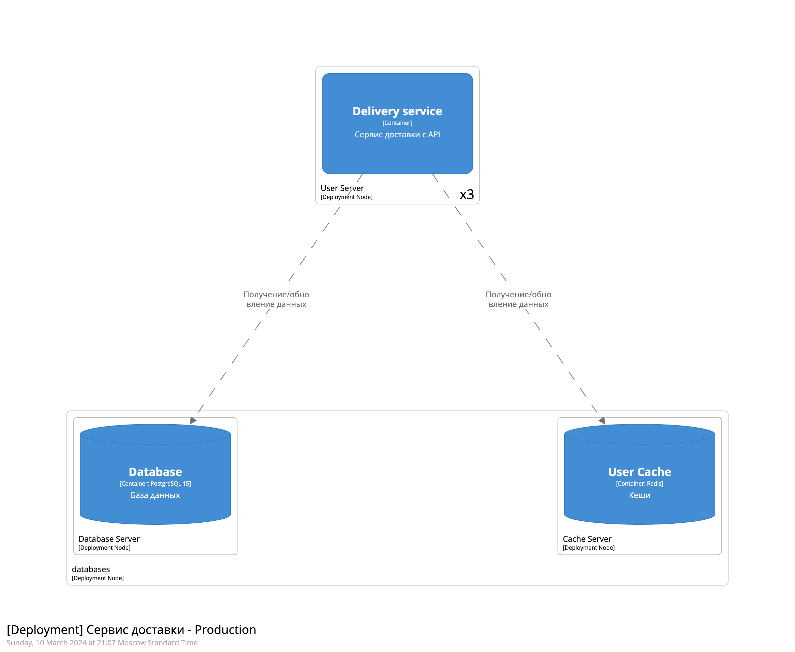
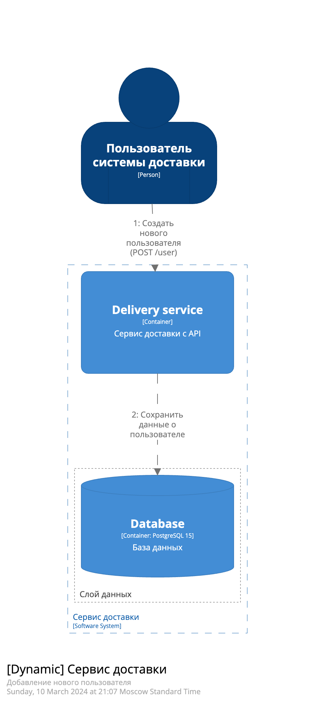
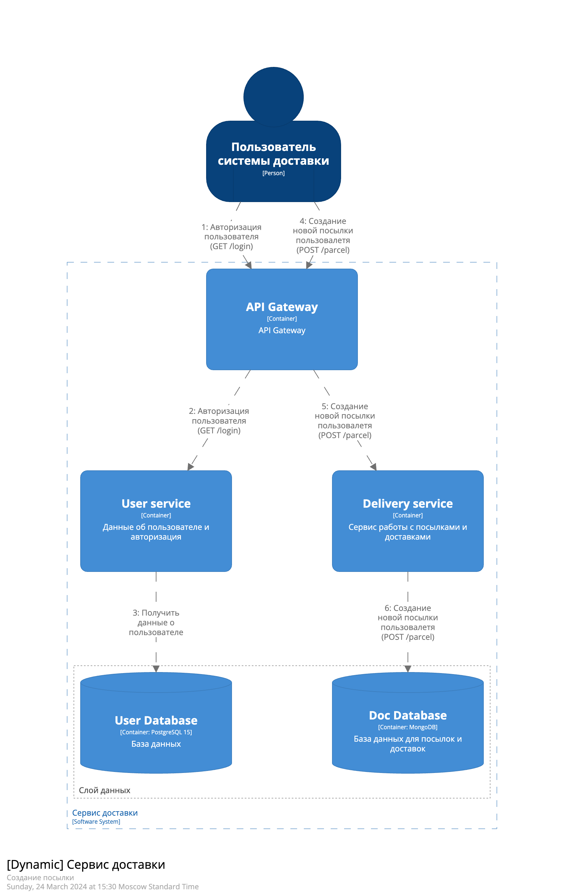

# Архитектура системы

## Требования к диаграммам

- Должна быть контекстная диаграмма
- Должна быть диаграмма контейнеров
- Должна быть диаграмма развертывания
- Должно быть несколько динамических диаграмм

## Диаграммы

### Контекстная диаграмма

### Диаграмма контейнеров

### Диаграмма развертывания

### Динамические диаграммы

